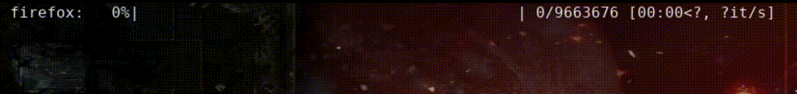

# Systemctl Memory Watcher

Animated watcher for systemdrun user scopes. 

## Usage

Launch some process in your GNU-Linux or compatible OS with `systemd-run` command, for example:

```bash
systemd-run --unit=firefox --user --scope -p MemoryHigh=8G -p MemoryMax=9G -p MemorySwapMax=1G firefox
```

(if you have doubts please review this [tutorial](https://dev.to/msugakov/taking-firefox-memory-usage-under-control-on-linux-4b02))

After that, you can use `sysmemwatch` for see the state of all scopes:

```bash
sysmemwatch firefox
```

## Output:

```bash
firefox:  31%|█████████            | 3024007/9663676
```

You can launch many scopes and also leave it in continuous loop:

```bash
sysmemwatch -l -t 30 firefox vscode studio
```



For more options, please run `sysmemwatch -h`


