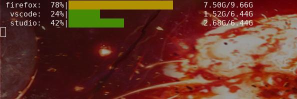

# Systemctl Memory Watcher


Animated watcher for systemdrun user scopes. 

## Usage

Launch some process in your GNU-Linux or compatible OS with `systemd-run` command, for example:

```bash
systemd-run --unit=firefox --user --scope -p MemoryHigh=8G -p MemoryMax=9G -p MemorySwapMax=1G firefox
```

(if you have doubts please review this [tutorial](https://dev.to/msugakov/taking-firefox-memory-usage-under-control-on-linux-4b02))

After that, you can use `sysmemwatch` for see the state of all scopes:

```bash
sysmemwatch firefox
```

## Output:

```bash
firefox:  31%|█████████            | 3024007/9663676
```

You can launch many scopes and also leave it in continuous loop:

```bash
sysmemwatch -l -t 30 firefox vscode studio
```




## Options

For more options, please run `sysmemwatch -h`, you should have something like this

```bash

syswatchmem -- utility for see the memory of each scope launched with systemd-run

Usage:
  syswatchmem  <scope>... 
  syswatchmem [--loop] [--no-stats] [--anim <tics>] [--time <delay>] <scope>...
  syswatchmem -h | --help
  syswatchmem -v | --version

Examples:
  syswatchmem -n firefox                # watch the memory of firefox one time without stats only %
  syswatchmem -l -t 60 firefox vscode   # loop mode: watch the memory of firefox and vscode each 60 seconds
  syswatchmem -a 5000 firefox vscode    # animate more the memory bars (minus is more slow)

Options:
  -l, --loop                    Loop forever
  -t <delay>, --time <delay>    Time between updates [default: 30] seconds
  -a <tics>, --anim <tics>      Anim speed [default: 10000] minus is slower
  -n, --no-stats                Disable statistics
  -h --help                     Show help screen.
  -v --version                  Show version.
```

